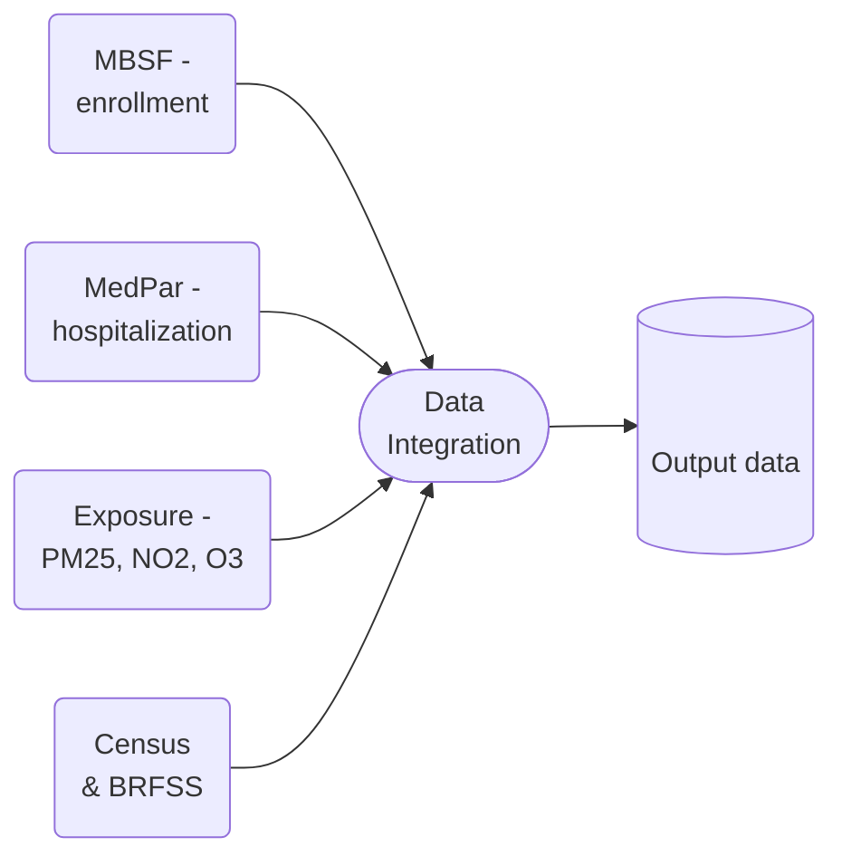

# First hospitalization with AKI and comorbidities in US Medicare data (2000-2016)

## Data integration workflow 

The code is located in the `code` directory. The input data is first converted from `.fst` into `.csv` (the code for that is in `code/preq`).

The workflow goes as follows:

1. We generate ICD 9/10 codes of interest, in `get_icd.R`
2. We create new diagnosis variables based on the ICD codes, in `add_diag_vars.py`
3. We identify first hospitalizations, in `get_first_hosp.py`
4. Final aggregation and denominators are computed in `aggregation.py`
5. Summary file (with denominator counts) is produced in `final_check.py`

Analysis code is deposited in directory `analysis`. The directory `notebooks` contain misc and development files.

## Run on SLURM

To reproduce the data, run the following commands in the command-line:

```
sh run_preq.sh
sh make_diag_vars.sh
sh find_first_hosp.sh
sh run_final.sh
```

You can run all of the scripts at once because job dependency is already incorporated in the script.

The bash scripts call code files from steps 2.-5. The ICD codes from step 1. was generated locally.

## Data diagram

The data diagram shows used data sources:



## Output data dictionary 


| Column_name        | Source               | Description                                                           |
|--------------------|----------------------|-----------------------------------------------------------------------|
| year               | MBSF                 | Year of enrollment.                                                   |
| sex                | MBSF                 | Beneficiary sex.                                                      |
| race               | MBSF                 | Beneficiary race.                                                     |
| zip                | MBSF                 | ZIP code                                                              |
| dual               | MBSF                 | Should be only 1.                                                     |
| follow_up          | Computed from MBSF   | Follow-up year.                                                       |
| entry_age_group    | Computed from MBSF   | Entry age group.                                                      |
| zcta               | Census               | Annual value.                                                         |
| poverty            | Census               | Annual value.                                                         |
| popdensity         | Census               | Annual value.                                                         |
| medianhousevalue   | Census               | Annual value.                                                         |
| pct_blk            | Census               | Annual value.                                                         |
| medhouseholdincome | Census               | Annual value.                                                         |
| pct_owner_occ      | Census               | Annual value.                                                         |
| hispanic           | Census               | Annual value.                                                         |
| education          | Census               | Annual value.                                                         |
| population         | Census               | Annual value.                                                         |
| pct_asian          | Census               | Annual value.                                                         |
| pct_native         | Census               | Annual value.                                                         |
| pct_white          | Census               | Annual value.                                                         |
| smoke_rate         | BRFSS                |                                                                       |
| mean_bmi           | BRFSS                |                                                                       |
| pm25.current_year  | Exposure             | |
| ozone.current_year | Exposure             | |
| no2.current_year   | Exposure             | |
| ozone_summer.current_year | Exposure      | |
| pm25.one_year_lag  | Exposure             | |
| ozone.one_year_lag | Exposure             | |
| no2.one_year_lag   | Exposure             | |
| ozone_summer.one_year_lag | Exposure      | |
| diabetes_primary_aki_secondary_first_hosp | Computed from MedPar | |
| diabetes_primary_aki_secondary_first_hosp_denom | Computed from MedPar | |
| csd_primary_aki_secondary_first_hosp | Computed from MedPar | |
| csd_primary_aki_secondary_first_hosp_denom | Computed from MedPar | |
| ihd_primary_aki_secondary_first_hosp | Computed from MedPar | |
| ihd_primary_aki_secondary_first_hosp_denom | Computed from MedPar | |
| pneumonia_primary_aki_secondary_first_hosp | Computed from MedPar | |
| pneumonia_primary_aki_secondary_first_hosp_denom | Computed from MedPar | |
| hf_primary_aki_secondary_first_hosp | Computed from MedPar | |
| hf_primary_aki_secondary_first_hosp_denom | Computed from MedPar | |
| ami_primary_aki_secondary_first_hosp | Computed from MedPar | |
| ami_primary_aki_secondary_first_hosp_denom | Computed from MedPar | |
| cerd_primary_aki_secondary_first_hosp | Computed from MedPar | |
| cerd_primary_aki_secondary_first_hosp_denom | Computed from MedPar | |
| uti_primary_aki_secondary_first_hosp | Computed from MedPar | |
| uti_primary_aki_secondary_first_hosp_denom | Computed from MedPar | |
| diabeteshosp_prior_aki | Computed from MedPar | |
| diabeteshosp_prior_aki_denom | Computed from MedPar | |
| ckdhosp_prior_aki | Computed from MedPar | |
| ckdhosp_prior_aki_denom | Computed from MedPar | |
| aki_primary_secondary_first_hosp | Computed from MedPar | |
| aki_primary_secondary_denom | Computed from MedPar | |


